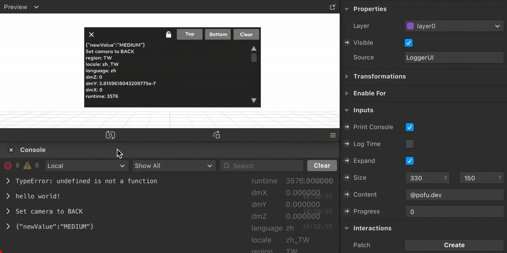

# Logger

****

**Logger** is a runtime console for Spark AR. It's based on [CustomConsole](https://github.com/ypmits/ARrrrLibTest/tree/master/scripts/CustomConsole) in [ypmits/ARrrrLibTest](https://github.com/ypmits/ARrrrLibTest).


## Install

1. Download [LoggerUI.arblockpkg](https://github.com/pofulu/sparkar-logger/releases/latest/download/LoggerUI.arblockpkg) and [Logger.ts](https://github.com/pofulu/sparkar-logger/releases/latest/download/Logger.ts) (It's minimized, you can find source codes [here]( https://github.com/pofulu/sparkar-logger/tree/main/LoggerDemo/scripts))

2. Drag them to your project

3. Drag LoggerUI block to scene

4. Import `Logger` to your script and use it just like [`Diagnostics`](https://sparkar.facebook.com/ar-studio/learn/reference/classes/diagnosticsmodule#example)

   ```typescript
   import Logger from './Logger';
   import Time from 'Time';
   
   Logger.log('hi');
   Logger.watch('runtime', Time.ms);

5. You can also [Click Here to Download Sample Project](https://github.com/pofulu/sparkar-logger/releases/latest/download/LoggerDemo.arprojpkg)


## Configuration

| Setting       | Description                                               |
| ------------- | --------------------------------------------------------- |
| Print Console | The value you log/watch will also show in editor console. |
| Log Time      | Log timestamp with format `HH:mm:ss`.                     |
| Expand        | Toggle open/close of the default state.                   |
| Size          | The window size of Logger.                                |
| Content       | DON'T edit this field, it's controlled by script.         |
| Progress      | DON'T edit this field, it's controlled by script.         |

If you want to disable Logger, just remove the LoggerUI block in scene or disable the visible of the block. There is a different between above two ways:

- **Remove** LoggerUI block, all `log`/`watch` in your script won't do anything.
- **Disable the visible** of LoggerUI block, all `log`/`watch` with work by [`Diagnostics`](https://sparkar.facebook.com/ar-studio/learn/reference/classes/diagnosticsmodule#example).


## Limitation

Please note that this tool **CAN'T** automatically catch inner error message from Spark AR. 

```javascript
TouchGestures.onPinch();
// If you don't enable the capability in Spark AR, you'll get an error in console but no message in Logger
```

If you want to catch them, you need to write your own try/catch and log messages will Logger in script.

```javascript
try {
  TouchGestures.onPinch();
} catch (error) {
  Logger.log(error.toString());
}
// Wrap it in try/catch so you can print the message both in logger and console.
```


## Donations

If this is useful for you, please consider a donation🙏🏼. One-time donations can be made with PayPal.

[](https://www.paypal.com/cgi-bin/webscr?cmd=_s-xclick&hosted_button_id=HW99ESSALJZ36)
